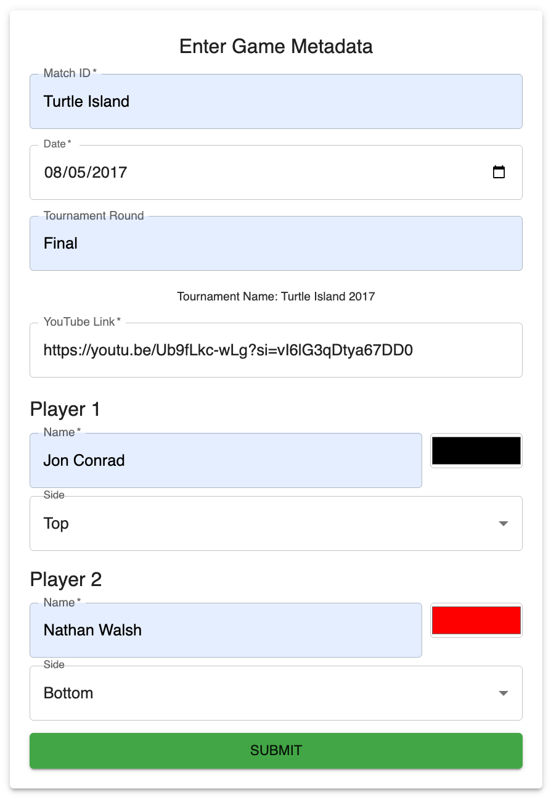

# Crokinole Game Tracker

## App Screenshots

<div align="center">
  <a href="docs/screenshots/shot_capture.png">
    
  </a>
  <a href="docs/screenshots/metatdata_entryexample.png">
    
  </a>
  <a href="docs/screenshots/shooter_selection.png">
    
  </a>
</div>

---
**Crokinole Stats MUI** is a modern, web-based application for tracking and analyzing Crokinole matches. Built with React and Material-UI, it provides an intuitive interface for inputting game metadata, recording shots on an interactive virtual board, managing scores, and exporting detailed game data as JSON files. Perfect for tournament organizers, players, and enthusiasts, it offers a polished, compact, and responsive design for comprehensive match statistics.

## Live Demo

Try the app live at [https://crokinole-shots.replit.app/](https://crokinole-shots.replit.app/).  
*Note*: Hosted on Replit, the demo may require a refresh to ensure images (e.g., Crokinole board) load correctly.

## Video Demonstration

Watch a demonstration of an earlier version tracking a match from the Turtle Island 2017 tournament:  
[View Video on Dropbox](https://www.dropbox.com/scl/fi/de8f3a9ac0grrsuzl2bll/example_shottracking_turtleisland2017.mov?rlkey=s7lh3huohseutsv3wenwh7odb&st=q53sg3sy&dl=0)  
*Note*: The current version includes an enhanced UI with a compact metadata form, centered player selection with disc indicators, disabled "Save Shot" button for empty shots, and other improvements.

## Features

- **Interactive Crokinole Board**: Record shots by clicking on a virtual board with automatic zone detection (e.g., Gutter, Outer Ring, 20s) using RGB color mapping. Double-click prevention alerts avoid duplicate disc placement.
- **Enhanced Shot Tracking UI**:
  - **Header**: Displays "Tournament Name" (left), "Round Number" (center, highlighted box), and "Tournament Round" (right), all with consistent font size.
  - **Shooter Info**: Compact display of current player, side, and shot number in a bordered box.
  - **20s Counts**: Chip components show 20s scored per player, matching the stats table, using player-specific colors.
  - **Undo Actions**: Distinct buttons for "Undo Disc" (dark blue, Backspace icon) and "Undo Shot" (purple, Undo icon).
  - **Player Selection**: Centered toggle buttons with disc-like circles before names, wider to prevent wrapping, and "Save Shot" button on the right (disabled until a disc is added).
- **Streamlined Metadata Entry**: Compact form for match ID, date, tournament round, YouTube link, and player details (names, sides, colors), with "Tournament Name" (e.g., `Crokinole Cup 2025`) displayed.
- **Real-Time Score Tracking**: Monitor shots, 20s, and cumulative match scores in a stats table, updated after each round.
- **Efficient Shot Management**: Add discs, undo discs or shots, and save shots (only with discs) with centered player selection.
- **Compact Score Input**: Two-row form with right-justified player names for round-end scoring.
- **JSON Export**: Export game data with filenames like `classified_FirstNamePlayer1FirstNamePlayer2_YearMatchID_TournamentRound.json`.
- **Responsive Design**: Material-UI ensures a professional, compact UI (~740-760px height) fitting standard viewports (e.g., 1366x768).

## Prerequisites

- **Node.js** (v14 or higher)
- **npm** (v6 or higher) or **yarn**
- **Git** (for cloning the repository)
- A modern web browser (e.g., Chrome, Firefox)

## Installation

1. **Clone the Repository**:
   ```bash
   git clone https://github.com/Gryph66/Crokinole-Stats-MUI.git
   cd Crokinole-Stats-MUI
   ```

2. **Install Dependencies**:
   ```bash
   npm install
   ```
   or
   ```bash
   yarn install
   ```
   Ensure `@mui/icons-material` version matches `@mui/material` (e.g., `^5.15.0` for `@mui/material@^5.18.0`).

3. **Start the Development Server**:
   ```bash
   npm start
   ```
   or
   ```bash
   yarn start
   ```
   The app opens at `http://localhost:3000`.

## Usage

### 1. Enter Game Metadata
- Input match details in a compact form:
  - **Match ID**: e.g., `Crokinole Cup`.
  - **Date**: e.g., `2025-07-07`.
  - **Tournament Round**: e.g., `Semi Final`.
  - **YouTube Link**: Video link for the match.
  - **Player Names and Details**: Names, board sides (Top/Bottom), and colors.
- "Tournament Name" (e.g., `Crokinole Cup 2025`) is displayed above the YouTube Link field.
- Click "Submit" to proceed.

**Screenshot**: [docs/screenshots/metadata-form.png](docs/screenshots/metadata-form.png) *(Placeholder: Update with current screenshot)*

### 2. Track Shots
- **Select First Shooter**: Choose using centered buttons.
- **Header**: Shows "Tournament Name" (left), "Round Number" (center, highlighted), "Tournament Round" (right), all same font size.
- **Shooter Info**: Compact display of current player, side, and shot number (~50% smaller).
- **20s Counts**: Chips show 20s per player, matching stats table.
- **Record Shots**: Click the board to place discs, with zone detection. Double-clicking triggers an alert ("Double-click detected!").
- **Manage Shots**:
  - "Undo Disc" (dark blue, Backspace icon): Remove the last disc.
  - "Undo Shot" (purple, Undo icon): Revert the last saved shot.
  - "Save Shot" (right, disabled until a disc is added): Commit shots.
- **Player Selection**: Centered toggle buttons with disc-like circles, wide enough for names (e.g., "Connor Reinman") on a single line.
- **Stats Table**: Real-time shots, 20s, and match scores.

**Screenshot**: [docs/screenshots/game-tracking.png](docs/screenshots/game-tracking.png) *(Placeholder: Update with current screenshot)*

### 3. End Round
- After 16 shots, enter scores in a compact two-row form with right-justified names.
- Submit to update "Match Score" and start the next round.

**Screenshot**: [docs/screenshots/score-input.png](docs/screenshots/score-input.png) *(Placeholder: Update with current screenshot)*

### 4. Export Game Data
- Click "End Game" to export JSON (e.g., `classified_ConnorAndrew_2025CrokinoleCup_SemiFinal.json`).
- JSON includes metadata and round data.

**Screenshot**: [docs/screenshots/export.png](docs/screenshots/export.png) *(Placeholder: Update with current screenshot)*

### 5. Review Exported Data
- JSON contains `metadata` (players, match ID, tournament name, etc.) and `rounds` (shots, scores).

## Project Structure

```
Crokinole-Stats-MUI/
├── public/
│   ├── crokinole_board.png          # Crokinole board image
│   ├── crokinole_board_colored.png  # Colored board for zone detection
│   └── index.html
├── src/
│   ├── App.jsx                      # Root component with error boundary
│   ├── BoardState.jsx               # Main game tracking component
│   ├── MetadataForm.jsx             # Form for entering game metadata
│   ├── ScoreInput.jsx               # End-of-round scoring component
│   ├── ShooterSelection.jsx         # Player selection component
│   ├── theme.js                     # Material-UI theme configuration
├── package.json
└── README.md
```

## Dependencies

- **React**: Frontend framework.
- **Material-UI**: Components and theming (`@mui/material@^5.18.0`).
- **Material-UI Icons**: Icons for UI (`@mui/icons-material@^5.x.x`).
- **Canvas API**: For board rendering and shot tracking.

See `package.json` for details. Ensure `@mui/icons-material` version matches `@mui/material`.

## Contributing

1. Fork the repository.
2. Create a branch (`git checkout -b feature/your-feature`).
3. Commit changes (`git commit -m "Add your feature"`).
4. Push to the branch (`git push origin feature/your-feature`).
5. Open a pull request on [GitHub](https://github.com/Gryph66/Crokinole-Stats-MUI/pulls).

## Issues

Report bugs or feature requests on [GitHub Issues](https://github.com/Gryph66/Crokinole-Stats-MUI/issues) with:
- Description of the issue.
- Steps to reproduce.
- Screenshots or logs.

## License

MIT License. See [LICENSE](LICENSE).

## Acknowledgments

- Built for the Crokinole community.
- Thanks to [Material-UI](https://mui.com/) for components and icons.
- Gratitude to contributors and testers.

*Happy Crokinole tracking! Open an issue on [GitHub](https://github.com/Gryph66/Crokinole-Stats-MUI/issues) for feedback.*
